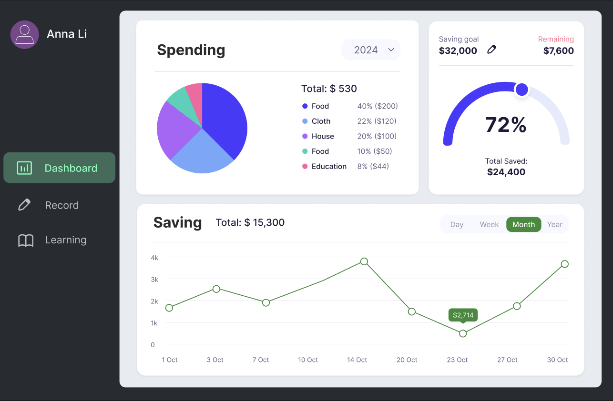
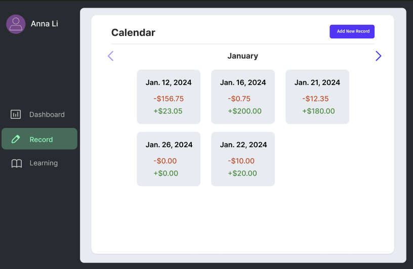
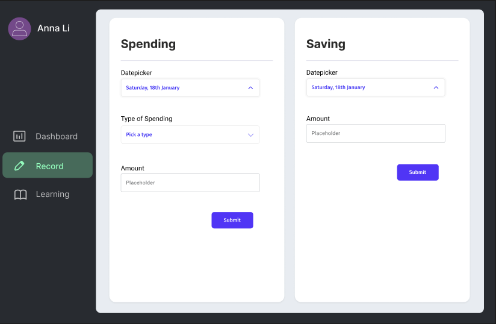
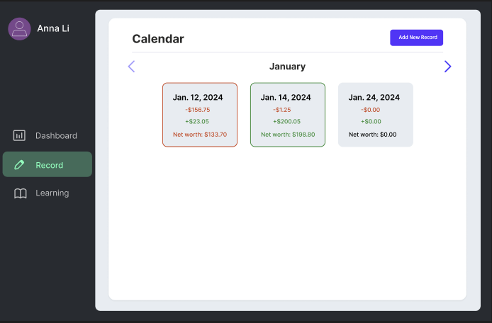
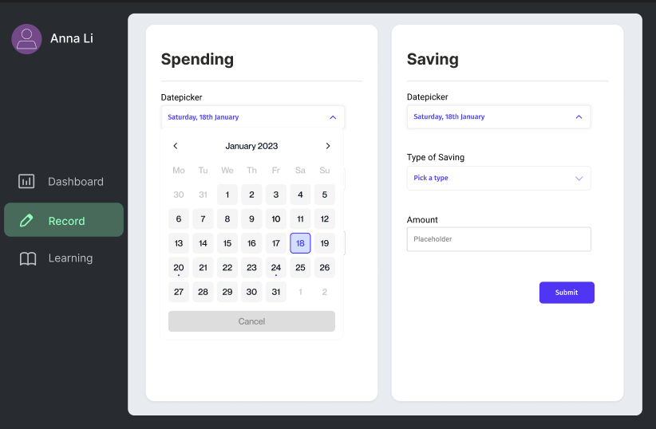
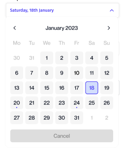
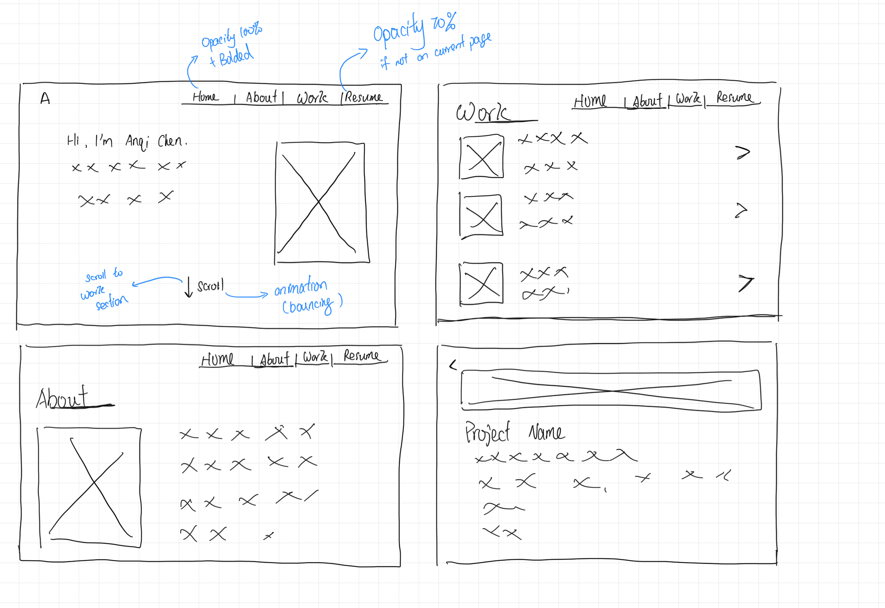
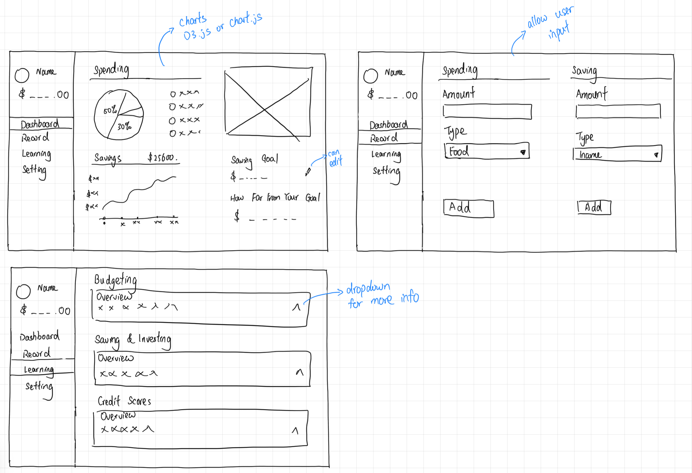

# **FP4 \- Final Project Writeup**

# **FP3 \- Final Project Check-in**

# FP2 - Evaluation of the Final project
## Project Description
The personal finance website is designed to help users track and manage their savings, spending, and net worth with ease. It includes interactive tools to visualize financial data and offers educational resources on fundamental personal finance concepts such as budgeting, saving, and credit. My goal is to empower users to make informed financial decisions and cultivate healthy financial habits. The platform is optimized for both desktops and iPads, making it accessible and user-friendly for a wide audience.

## High-Fi Prototypes

### *Prototype 1*

*Description:*
The Dashboard Overview provides a clean, organized view of users’ financial data, including summaries of spending, savings, and net worth. Users can quickly assess their financial health using color-coded indicators and easy-to-read charts.

### *Prototype 2*

*Description:*
This prototype focuses on the Add New Record feature, enabling users to log their financial transactions with options to categorize each entry and set dates. The interface is streamlined to support quick and accurate data entry.

## Usability Test
The type of testing I conducted is the Thinking-Outloud Testing, where users need to verbalize their thoughts while completing tasks, providing insights into usability and immediate reactions. During the usability testing, I received valuable feedback on functionality and user experience.  Users appreciated the simple, clean layout of the dashboard, with its visually engaging and accessible design. They specifically liked how the Add Record feature was easy to find and navigate. Based on their feedback, I removed the redundant “Choose Date” button to simplify the interaction, enabling direct date selection through the date field.

A key suggestion was to add a net worth indicator on each record card, which I redesigned to provide immediate visual feedback on whether the net worth is positive or negative. This color-coded indicator helps users quickly assess their financial status per transaction, enhancing usability. Additionally, users suggested a custom category option for both savings and spending. While I found this feature beneficial, it would add complexity to the database structure and the backend, so I decided to place it in a “nice-to-have” list for future updates.

Other feedback included ideas for adding a “currency” tab to change and convert the recorded currency and a login page for each user. This wasn’t part of my initial plan, but it was a good feature to have to give users more freedom to customize the webpage. I am considering those two feedbacks for future iterations, but for now due to the time constrain and the complexity in implementing these, I put those two features in the "nice to have" list. 

## Updated Designs

Record Cars Enhancements: Integrated a color-coded net worth indicator on each record card, offering users a quick visual summary of positive or negative net worth.

Streamlined Date Selection: Removed the redundant “Choose Date” button, simplifying date input by enabling users to click directly on the date field, and also providing the "Type" selection for Savings.

## Feedback Summary

During the lab session, I received valuable feedback on ways to improve the usability and clarity of my personal finance website. One of the primary suggestions was to remove the dots on the calendar if they lack a clear function, as users found them visually confusing without an explanation. Additionally, users suggested changing the term “Saving” to “Income” for greater clarity in labeling, making it more intuitive for users to understand the sources of their financial entries. But I decided not to change the "Saving" title because I am planning to allow user to choose types of "saving" which could be cover alot of types user save money. 

For the Record Card feature, users emphasized the need for better visual hierarchy to distinguish between the title and details of each record. They recommended a more dramatic visual presentation of the Record Card, especially by making the final daily record or summary more prominent and visible. This feedback also included suggestions to add indicators beyond just color to signify positive or negative net worth changes. For instance, adding a background color to the net change section would help draw attention, while renaming “net worth” to “net change” or consolidating it into a single large number with a +/- sign would make it more intuitive and visible to users at a glance.

Another small but helpful suggestion was to change “Datepicker” to simply “Date” to simplify the language and avoid potential confusion. By implementing these changes, I aim to create a clearer and more visually engaging interface that better serves the needs of users. This feedback highlighted the importance of consistent language, visual hierarchy, and intuitive labeling in designing an effective personal finance tool.

## Milestones

This plan outlines the weekly milestones for implementing and refining the personal finance website project, with a target completion date of Dec 6.

### *Implementation Plan*

- [X] Week 9 Oct 28 \- Nov 1:
  - [X] FP1 due
  
- [ ] Week 10 Nov 4 \- Nov 8:   
  - [X] FP2 due
  - [X] Complete the basic structure for the remaining three pages, ensuring all menu items are functional and the navigation is seamless.

- [ ] Week 11 Nov 11 \- Nov 15:
  - [ ]  Implement the Record page interface, focusing on the layout and general structure.
  - [ ]  Begin setting up form fields for user input on the Record page, allowing the entry of financial data.
      
- [ ] Week 12 Nov 18 \- Nov 22:
  - [ ] Finalize the Record page, including the second-page form interface.
  - [ ] Ensure Record page functionality works as expected, allowing users to fill in forms for both spending and saving categories.
  - [ ] Display submitted records on the main Record page for a user-friendly summary of their entries.
          
- [ ] Week 13 Nov 25 \- Nov 29:
- [ ] implemented different charts for the dahsboard page
- [ ] collect information that will be displayed on the "Learning" page & complete the Leanring page
- [ ] Thanksgiving (adjust schedule as needed for holiday)
        
- [ ] Week 14 Dec 2 \- Dec 6:  
  - [ ] FP4 due - Incorporate all updates, finalize the project report, and document the results of the final user testing.

### *Libraries and Other Components*

- Chart.js: To create interactive charts for financial data visualization.
- Moment.js: For easy handling and formatting of date data in transaction records.
- jQuery: For simplified DOM manipulation, particularly in form elements.

## Generative AI Use Plan

To enhance implementation, I plan to use Generative AI tools such as ChatGPT to support various aspects of the project. ChatGPT will be particularly useful for understanding and implementing the JavaScript libraries I’ve chosen, especially Chart.js for data visualizations. ChatGPT can provide code snippets, explain complex concepts, and troubleshoot common issues with library integration, which will be helpful when trying to make the charts respond to user-inputted data.

Additionally, I will use ChatGPT for crafting user-friendly error messages and refining the language on instructional sections of the Learning page. For instance, it can help with phrasing tips on budgeting or saving, ensuring the language is clear and accessible.

To maintain transparency and responsible AI use, I will add comments to the code to cite lines or segments generated by ChatGPT or other Generative AI tools. This will indicate which parts of the code are AI-assisted, ensuring clear documentation for future reference and accountability.

### *Tool Use*
*ChatGPT*
- I will use it for understanding and integrating libraries (e.g., Chart.js) by asking for example snippets or troubleshooting integration issues. It will also assist with crafting accessible instructional text for the Learning page.
- I will not use it for creating the HTML and CSS structure of the pages or implementing foundational JavaScript features like adding notes and user input forms, as these aspects are intended to demonstrate my understanding of lecture material.

### *Responsible Use*
I will  cite lines of code generated by ChatGPT with comments in my files to indicate AI assistance, providing transparency and clear documentation. For content, AI-generated instructional text will be edited for clarity, accuracy, and suitability for the intended user base.

# **FP1 \- Proposal for Critique**
## **Idea 1: Personal Website**

### Purpose
The goal of the personal website is to create an engaging online portfolio that showcases my skills, projects, and interests. It will serve as a digital introduction to potential employers or anyone interested in learning more about me, providing easy access to my resume, portfolio, and contact information.

### How the Design Will Be Interactive and Engaging:
* Scroll Animations: Smooth transitions and animations engage users as they explore different sections.
* Project Portfolio: Users can click on project cards to see more details.
* Light/Dark Mode Toggle: Allows users to switch between light and dark themes.

### How the Design Will Be Accessible:
* High Contrast Theme Options: Improves readability for all users, with a light/dark mode toggle.
* Keyboard Accessible Navigation: Allows users to navigate the site using only a keyboard.
* Alt Text for Project Images: Provides descriptions for all visual elements in the portfolio.

### Information & Content:
* Home Page: Brief introduction with animations for an engaging first impression.
* About Me: A section about your background, skills, and personal interests.
* Project Detail & Project Section: Includes project cards with descriptions, images, and demo links.
* Resume Download: A downloadable resume for employers or collaborators.

## **Idea 2: Personal Finance Website**

### Purpose
The goal of the personal finance website is to help users track and manage their savings and spending through interactive tools. It will also offer beginner-friendly educational resources on essential personal finance concepts, such as budgeting, saving, and credit, empowering users to make better financial decisions and build healthy financial habits.

### How the Design Will Be Interactive and Engaging:
* Dashboard with Charts: Use D3.js or Chart.js to visualize spending, savings, and goals.
Input Forms for Spending and Saving: Users can log their transactions with categories (like food, rent, income).
* Savings Tracker: A dynamic progress bar shows how close users are to reaching their savings goals.
* Expandable Learning Cards: Dropdowns provide users with more information on key finance concepts (like budgeting or credit scores).

### How the Design Will Be Accessible:
* Responsive Layouts: Ensure usability on both desktop and mobile devices.
* Alt Text for Icons and Graphs: Supports users with visual impairments.
* Form Labels: Forms will include semantic HTML for accessibility.

### Information & Content:
* Dashboard: Displays savings and spending overviews with visual charts.
* Record Section: Input forms for tracking income, savings, and spending.
* Learning Section: Offers educational resources about budgeting, saving, investing, and credit scores.

## **Idea 3: Ice Cream in Pittsburgh Website**

### Purpose
The goal of the Ice Cream in Pittsburgh website is to provide users with a comprehensive guide to the best ice cream shops in the city. It will feature shop locations, descriptions, and user-friendly ratings based on Google reviews, helping visitors and locals discover new places to enjoy ice cream in Pittsburgh. It also provides receipts on how to make ice-cream at home. 

### How the Design Will Be Interactive and Engaging:
* Google Maps Integration: An embedded map shows the location of ice cream shops in Pittsburgh.
* Dynamic Content: Clicking on shop cards navigates to detail pages with more information about each shop (like reviews and location).
* Rating System: Incorporate star ratings pulled from Google Reviews or display mock ratings.
* Change Ice-cream feature: A fun interactive part that allows users to change the image displayed on the home page, making the website fun.

### How the Design Will Be Accessible:
* High Contrast Text: Ensures readability for all users.
* Alt Text for Images: Provides context for visually impaired users.
* Text Alternatives for Maps: Lists the shops and their locations alongside the map view for accessibility.

### Information & Content
* Home Page: Overview of top ice cream shops with interactive cards.
* Shop Pages: Includes name, description, images or videos, and embedded Google Maps for directions.
* Make Your Own Ice Cream: A step-by-step guide to making ice cream at home.
* User Reviews Section: Display ratings and reviews from users or Google.
* Responsive Layouts: having the website accessible on both desktop and iPad screen sizes.

## Feedback Summary
The portfolio site was praised for its dynamic feature of text appearing as the user scrolls, and the addition of a light and dark mode was recognized as a good way to showcase coding skills. For the personal finance site, peers appreciated the sidebar for its navigation and organizational clarity. They also suggested incorporating video tutorials to enhance its educational value and highlighted that the use of visuals would make complex information more digestible. For the ice-cream shop site, the interactive homepage feature, which changes images based on flavors, was well-received. However, peers noted that including recipes seemed somewhat out of place. They also recommended embedding Google reviews for each shop and suggested adding a tracker to show which pages the user has visited.

## Feedback Digestion
After reviewing the feedback, I have decided to proceed with the personal finance website, as it aligns most closely with my interests and goals. The positive feedback on the sidebar navigation reinforced the idea of maintaining a clear information structure, which will remain a key design element. I will also incorporate video tutorials, as suggested by my peers, to make the site more educational and engaging for users. Additionally, I’ll also consider the feedback of focusing on using visuals to present financial information in a more accessible and less overwhelming way.

