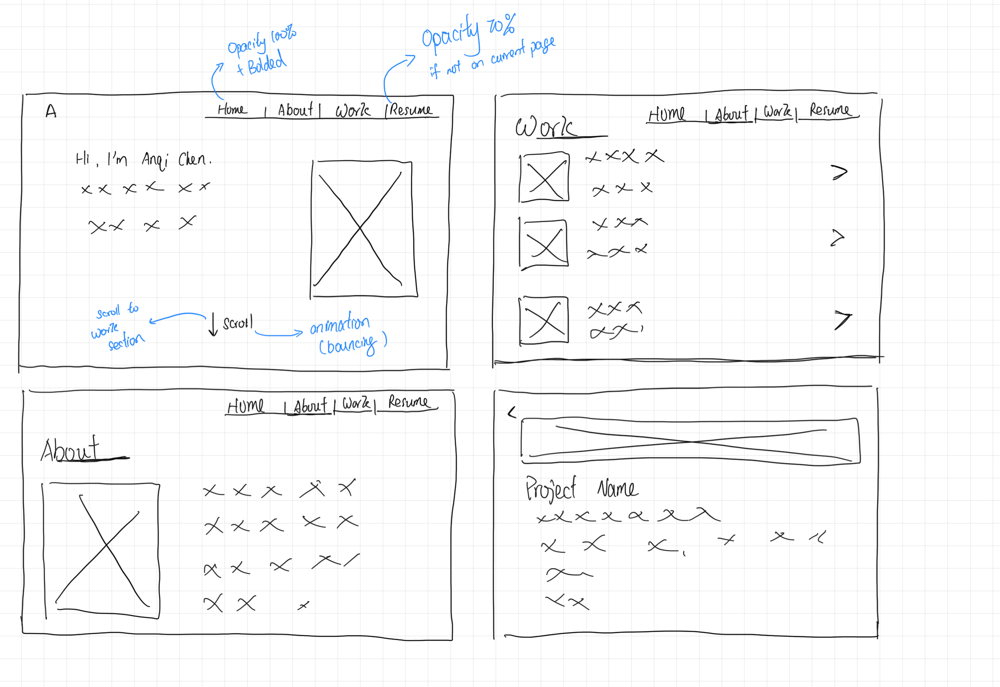
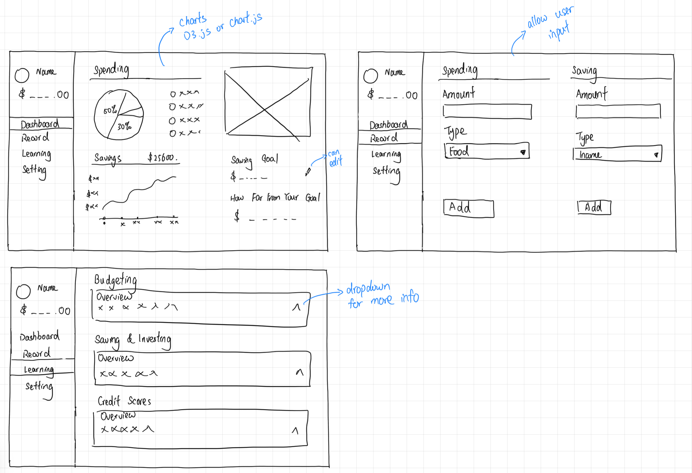
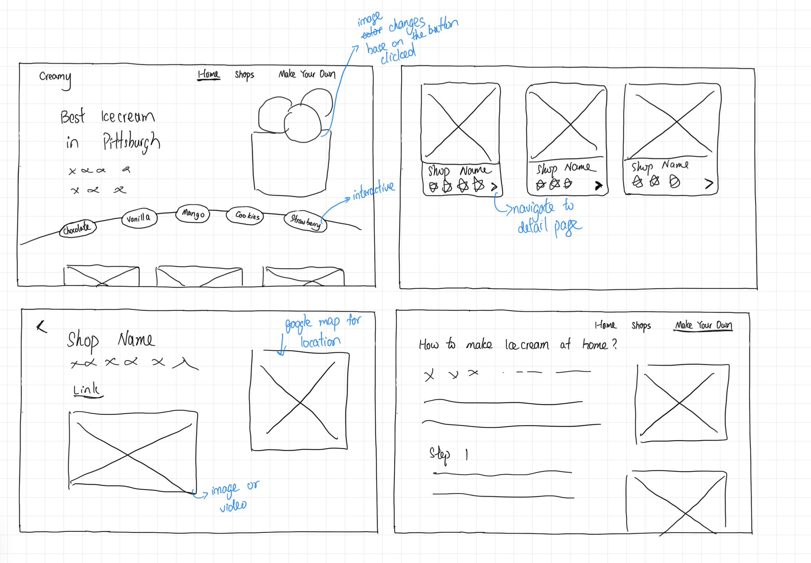

# FP4 - Final Project Writeup

# FP2 - Evaluation of the Final project

# FP1 - Proposal for Critique
## Idea 1: Personal Website

### Purpose
The goal of the personal website is to create an engaging online portfolio that showcases my skills, projects, and interests. It will serve as a digital introduction to potential employers or anyone interested in learning more about me, providing easy access to my resume, portfolio, and contact information.

### How the Design Will Be Interactive and Engaging:
Scroll Animations: Smooth transitions and animations engage users as they explore different sections.
Project Portfolio: Users can click on project cards to see more details.
Light/Dark Mode Toggle: Allows users to switch between light and dark themes.

### How the Design Will Be Accessible:
High Contrast Theme Options: Improves readability for all users, with a light/dark mode toggle.
Keyboard Accessible Navigation: Allows users to navigate the site using only a keyboard.
Alt Text for Project Images: Provides descriptions for all visual elements in the portfolio.

### Information & Content:
Home Page: Brief introduction with animations for an engaging first impression.
About Me: A section about your background, skills, and personal interests.
Project Detail & Project Section: Includes project cards with descriptions, images, and demo links.
Resume Download: A downloadable resume for employers or collaborators.

## Idea 2: Personal Finance Website

### Purpose
The goal of the personal finance website is to help users track and manage their savings and spending through interactive tools. It will also offer beginner-friendly educational resources on essential personal finance concepts, such as budgeting, saving, and credit, empowering users to make better financial decisions and build healthy financial habits.

### How the Design Will Be Interactive and Engaging:
Dashboard with Charts: Use D3.js or Chart.js to visualize spending, savings, and goals.
Input Forms for Spending and Saving: Users can log their transactions with categories (like food, rent, income).
Savings Tracker: A dynamic progress bar shows how close users are to reaching their savings goals.
Expandable Learning Cards: Dropdowns provide users with more information on key finance concepts (like budgeting or credit scores).

### How the Design Will Be Accessible:
Responsive Layouts: Ensure usability on both desktop and mobile devices.
Alt Text for Icons and Graphs: Supports users with visual impairments.
ARIA Roles and Form Labels: Forms will include semantic HTML for accessibility.

### Information & Content:
Dashboard: Displays savings and spending overviews with visual charts.
Record Section: Input forms for tracking income, savings, and spending.
Learning Section: Offers educational resources about budgeting, saving, investing, and credit scores.

## Idea 3: Ice Cream in Pittsburgh Website

### Purpose
The goal of the Ice Cream in Pittsburgh website is to provide users with a comprehensive guide to the best ice cream shops in the city. It will feature shop locations, descriptions, and user-friendly ratings based on Google reviews, helping visitors and locals discover new places to enjoy ice cream in Pittsburgh. It also provides receipts on how to make ice-cream at home. 

### How the Design Will Be Interactive and Engaging:
Google Maps Integration: An embedded map shows the location of ice cream shops in Pittsburgh.
Dynamic Content: Clicking on shop cards navigates to detail pages with more information about each shop (like reviews and location).
Rating System: Incorporate star ratings pulled from Google Reviews or display mock ratings.
Change Ice-cream feature: A fun interactive part which allows users to change the image displayed on the home page, making the website fun.

### How the Design Will Be Accessible:
High Contrast Text: Ensures readability for all users.
Alt Text for Images: Provides context for visually impaired users.
Text Alternatives for Maps: Lists the shops and their locations alongside the map view for accessibility.
Information and Content to Include:

### Information & Content
Home Page: Overview of top ice cream shops with interactive cards.
Shop Pages: Includes name, description, images or videos, and embedded Google Maps for directions.
Make Your Own Ice Cream: A step-by-step guide to making ice cream at home.
User Reviews Section: Display ratings and reviews from users or Google.
Responsive Layouts: having the website accessible on both desktop and ipad screen sizes.

